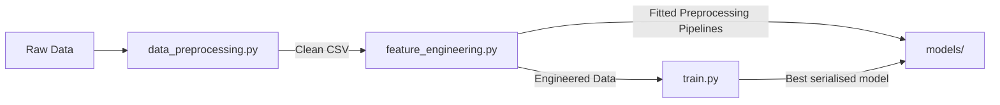
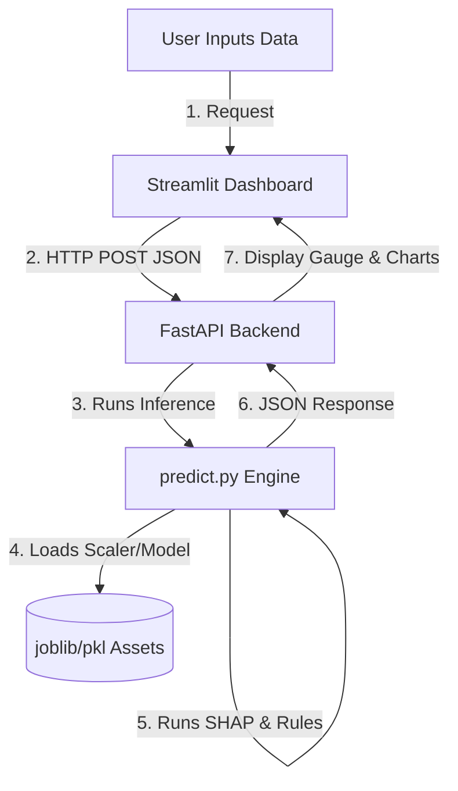

# Telecom Customer Churn Predictor 🔮

Hey there! This is an end-to-end machine learning project I built to predict customer churn for telecom subscribers. 

It takes raw customer data (like contract types, demographics, and billing info) and predicts how likely they are to leave. The project features a **FastAPI** backend that handles the ML inference, and a clean **Streamlit** web app where you can input customer stats and see their risk scores in real-time.

---

## 🚀 Quick Start

Follow these steps to get the app running on your machine:

### 1. Clone the repo
```bash
git clone https://github.com/Harsh110306/Customer-Churn-Predication.git
cd customer_churn
```

### 2. Set up a virtual environment
```bash
python -m venv venv

# Activate it (Windows PowerShell):
.\venv\Scripts\Activate.ps1

# Activate it (macOS/Linux):
source venv/bin/activate
```

### 3. Install dependencies
```bash
pip install -r requirements.txt
```

### 4. Train the model
Run the training script to preprocess the data, engineer features, and train the classifier:
```bash
python src/train.py
```
This will save the trained model assets inside the `models/` directory.

### 5. Run the FastAPI backend
Start the API server:
```bash
uvicorn api.app:app --host 0.0.0.0 --port 8000 --reload
```
You can view the interactive API docs at `http://localhost:8000/docs`.

### 6. Run the Streamlit dashboard
Open a new terminal tab (ensure your virtual environment is active) and run:
```bash
streamlit run dashboard/streamlit_app.py
```
This will open the dashboard UI in your browser at `http://localhost:8501`.

---

## 🔄 Project Flow & Architecture

The system is split into two core pipelines:

### 1. Offline Pipeline (Data Prep & Training)
Before the app can predict anything, the data is cleaned, features are engineered, and the model is trained offline:



* **`data_preprocessing.py`**: Loads the raw CSV, drops ID and leakage columns, handles missing charges, and saves to `data/processed/cleaned_churn.csv`.
* **`feature_engineering.py`**: Creates custom features (like `Tenure Group` and `Average Monthly Spend`), fits a One-Hot Encoder/Standard Scaler, and saves them to `models/` for reuse.
* **`train.py`**: Compares algorithms (Logistic Regression, Decision Trees, Random Forests, XGBoost), tunes the best-performing model (Random Forest), and saves it as `churn_model.pkl` along with SHAP explainer assets.

### 2. Online Pipeline (Live Predictions)
Once the models are saved, the dashboard and backend live services handle requests and explain outputs:



* **`predict.py`**: The core inference engine. It takes raw customer attributes, runs the preprocessing steps, predicts the churn risk probability, runs **SHAP** to get local factor importances, and applies business rules to generate custom retention recommendations.
* **`api/app.py`**: FastAPI server exposing a `/predict` JSON POST endpoint.
* **`dashboard/streamlit_app.py`**: Streamlit dashboard where users input attributes, see risk gauges, read custom recommendations, and view SHAP charts.

---

## 🛠️ How It's Built

Here's a quick look at the directory structure and what each file does:

```text
customer_churn/
├── data/
│   ├── raw/                  # Original CSV dataset
│   └── processed/            # Cleaned data ready for features
├── models/                   # Saved models (PKL/Joblib assets)
├── notebooks/                # Jupyter Notebooks for testing and exploration
├── src/                      # Core python code
│   ├── data_preprocessing.py # Cleaning and handling missing data
│   ├── feature_engineering.py# Scaling and One-Hot Encoding
│   ├── train.py              # Comparing algorithms & training the best model
│   ├── predict.py            # Local inference engine + SHAP setup
│   └── utils.py              # Loggers and helper functions
├── api/
│   └── app.py                # FastAPI endpoints
├── dashboard/
│   └── streamlit_app.py      # Streamlit web app
└── requirements.txt          # Package list
```

### The ML Pipeline
1. **Data Preprocessing**: Cleans columns, drops ID/constant fields, and handles missing charge values.
2. **Feature Engineering**: Creates new features like `Tenure Group`, `Average Monthly Spend`, and scaling/encoding.
3. **Model Training**: Compares algorithms (Logistic Regression, Decision Trees, Random Forest, XGBoost) and trains the best one.
4. **Explainability**: Computes SHAP values to explain which features push risk higher or lower for individual customers.

---

## 📊 Model Evaluation Results

Here's how different models performed during my baseline comparison (evaluating recall on the churned class to avoid missing high-risk customers):

| Model | Test Accuracy | Precision | Recall (Churn) | F1-Score |
| :--- | :---: | :---: | :---: | :---: |
| Logistic Regression | 80.12% | 64.41% | 56.14% | 60.00% |
| Decision Tree | 78.28% | 59.23% | 58.28% | 58.76% |
| Random Forest (Tuned) | 76.86% | 55.00% | 75.40% | 63.37% |
| Gradient Boosting | 79.41% | 64.18% | 50.80% | 56.71% |
| XGBoost | 78.85% | 61.72% | 53.47% | 57.30% |

I tuned the **Random Forest** classifier using Grid Search to optimize for F1-Score and Recall, ensuring we catch as many churn-prone customers as possible.

---

## 🐳 Running with Docker

If you prefer to run everything in a container, a `Dockerfile` is included.

1. Build the image:
```bash
docker build -t customer-churn-app .
```

2. Run the container (exposes ports 8000 for the backend and 8501 for the dashboard):
```bash
docker run -p 8000:8000 -p 8501:8501 customer-churn-app
```

---

*Feel free to star the repo if you find this useful!*
